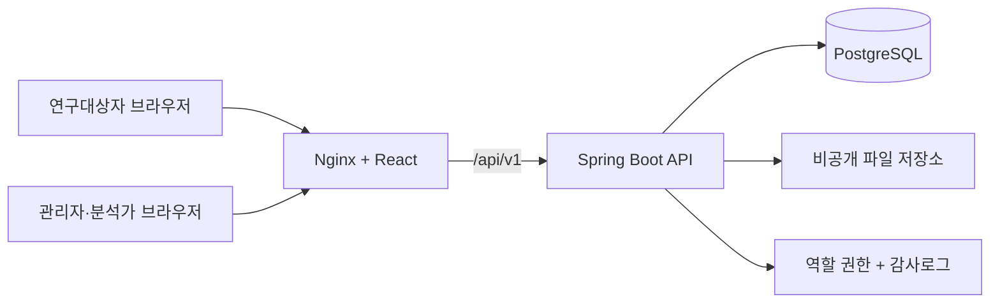
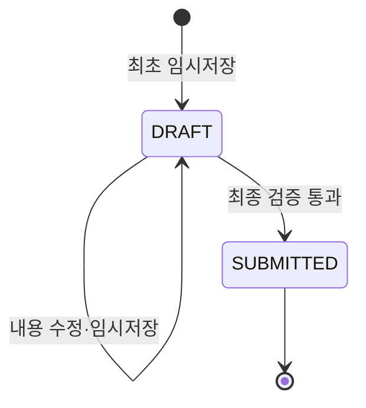
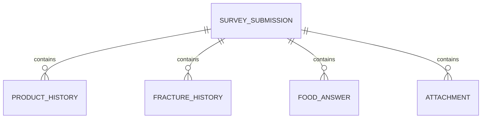

# 시스템 구조

## 전체 흐름

## 각 구성요소의 역할

| 구성요소 | 역할 |
|---|---|
| React | 설문 단계, 조건부 문항, 반복 입력, 브라우저 임시저장 |
| Nginx | 정적 화면 제공, `/api` 요청을 백엔드로 전달 |
| Spring Boot | 요청 검증, 임시저장, 최종제출, 첨부파일, 인증·집계 처리 |
| PostgreSQL | 제출·제품·골절·식품·첨부 메타데이터와 관리자 감사로그 저장 |
| 파일 볼륨 | 실제 이미지 바이트 저장 |
| Flyway | DB 테이블 변경 이력 관리 |

## 제출 상태

- `DRAFT`: 사용자 수정 가능
- `SUBMITTED`: 현재 MVP에서는 수정 불가
- 최종 제출 요청이 반복되면 `409 Conflict`를 반환하여 중복 변경을 방지합니다.

## 데이터 관계

## 현재 보안 경계

현재 구현은 개발용 기본구조입니다.

- 제출 ID는 UUID라 단순 연속번호보다 추측하기 어렵지만 인증수단은 아닙니다.
- 실제 운영에서는 대상자용 접근 토큰 또는 문자 인증이 필요합니다.
- 업로드는 Content-Type, 파일 시그니처, 용량을 확인하지만 악성코드 검사는 아직 없습니다.
- 첨부파일 다운로드 API는 의도적으로 제공하지 않았습니다.
- 개인정보 컬럼은 아직 애플리케이션 암호화가 적용되지 않았습니다.
- 관리자 조회 API는 `ADMIN` 또는 `ANALYST` 역할만 접근하며 개별 응답 대신 집계값만 반환합니다.
- 항목별 표본이 기본 5명 미만이면 정확한 수치를 반환하지 않습니다.
- 관리자 로그인 확인과 통계 조회 성공은 감사로그에 기록합니다.
- 현재 계정은 환경변수 기반 메모리 계정이고 HTTP Basic을 사용하므로 로컬·PoC 기준입니다. 운영 전 HTTPS와 SSO/OIDC 등 외부 인증 연동이 필요합니다.

## 다음 권장 단계

1. 대상자 고유 링크·일회성 토큰
2. 개인정보 컬럼 암호화 및 키 관리
3. 관리자 계정 DB·SSO 연동과 로그인 실패 제한
4. 설문 문항 버전 관리·검토·발행 편집기
5. S3·MinIO 등 비공개 Object Storage 전환
6. 외부기관 전송 원장과 재시도 워커
